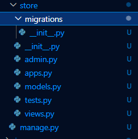
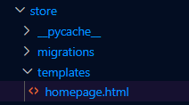
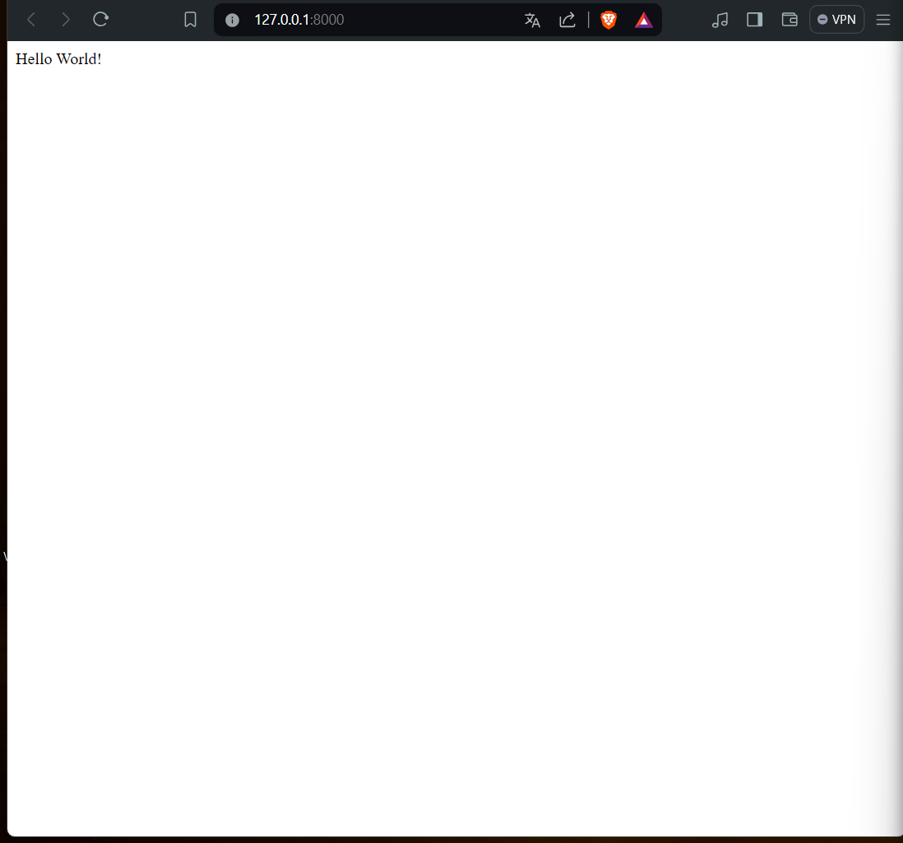
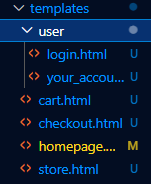
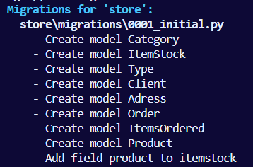
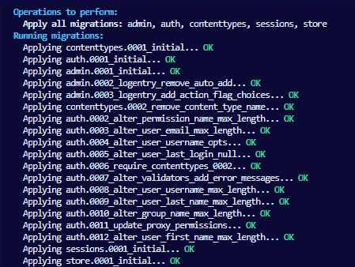
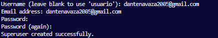
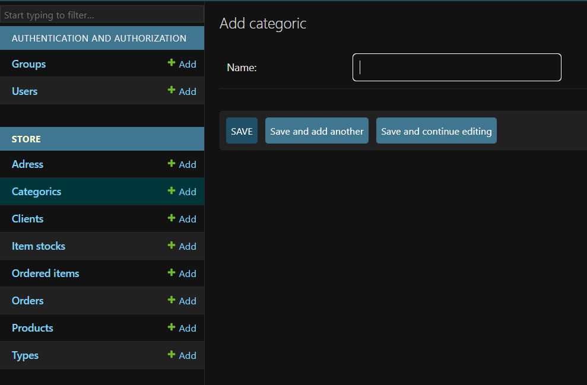
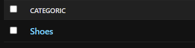

# Ecommerce python django

# **INITIALIZING**

 Repository containin the files for the ecomerce website replica of reserva

Create a virtual enviroment in vscode

Start by installing django:

```
pip install django
```

Whithout exiting the comand prompt, create the necessary folders with:

```
django-admin startproject ecommerce
```


Acess the manage.py file:

```
cd ecommerce
```

A django site is composed of many "apps" (sub-sites) that contain major features of the main site. Ex: a blog would be a separate "app" from a online store as they have significantly different features

Run: python manage.py startapp store
This will create a new folder that will contain the features related to the online store



to run the app locally: python manage.py runserver

### ECOMMERCE FILE

The manage.py file will manage and load all the configurations  (located inside the settings.py file) of the website

The __ init __.py file only establishes the ecommerce folder as a module/project folder so the manage.py file can pull data from there

The wsgi.py and asgi.pi files  will only be used in the final deployment fase

The urls.puy file configures the url of the website and what content it will load based on the url

Lastly the settings.py file is where we will configure the settings of the website such as criptografy, debuging mode, installed apps etc


### STORE APP FILE

The migration folder will store the modifications done in the databases

The __ init __.py file serves the same purpose as the ecommerce file

The admin.py file will contain what will appear in the admin page of the website

The models.py file will contain the models of the databases necessary for the creation of the products

The apps.py file delcares the name of the app to be added in the main configuration

The tests.py file is useful for performing tests and experiment features

The views.py file will contains what will appear in each url mentioned in the urls.py file

---

# Code Start (first page)

In the urls.py file we added the include() function in the imports to use the urls from other apps

```python
from django.urls import path, include #? Added the include function to use the urls from the store app
```

We will create our first url path for the main online store which will acess the links on the store urls file:

```python
path('', include('store.urls')), #? all the links from the store app will be loaded on the  root url (as we will only use one app, 'store')
```

Next we will create the urls.py file in the store folder so it can be acessed. Afterwards we will add the link of the homepage

In order to do that, we will first add a homepage() function to the views.py file as it is responsible for what happens in each url.

```python
def homepage():
    pass
```

Now we will create the homepage url:

```python
from django.urls import path
from .views import * #? Importing everything from the views folder in the same directory

urlpatterns = [
    path('', homepage, name="homepage"), #? first parameter is the url, second is what function will be runned at the url, and the third is the internal name of the link used to reference the link regardless of its url domain
]
```

When you enter a website link you are doing a **request** to that website.  Said requests usally have two formats:

* GET: Getting a desired information
* POST:  Sending a determined information to the website

This will be seen in the homepage() function, that will recieve a request as its parameter so it can return the html file of the homepage template, which will be created inside a templates folder on the store file  that django will automatically search for. jij



```html
<!DOCTYPE html>
<html lang="en">
<head>
    <meta charset="UTF-8">
    <meta name="viewport" content="width=device-width, initial-scale=1.0">
    <title>Document</title>
</head>
<body>
    Hello World!
</body>
</html>
```

Now we will edit the homepage function in the store's views.py file to recieve the request of returning said html file.

```python
def homepage(request): #? the first parameter always has to be a request
    return render(request, 'homepage.html') #? returns the homepage
```

Testing (remember to always be inside the ecommerce folder in the cmd prompt):

```
cd ecommerce
```

```
python manage.py runserver
```



---

# Creation of various urls

We will create 6 different links in total:

* Main page
* Store
* Your account
* Login
* Cart
* Checkout

In order to do this we will repeat the same steps shown previously with the creation of the homepage.

1) Defining a url for each page on the urls.py:

```python
urlpatterns = [
    path('', homepage, name="homepage"), #? first parameter is the url, second is what function will be runned at the url, and the third is the internal name of the link used to reference the link regardless of its url domain
    path('store/', store, name="store"), 
    path('youraccount/', your_account, name="your_account"), 
    path('login/', login, name="login"), 
    path('cart/', cart, name="cart"), 
    path('checkout/', checkout, name="checkout"), 
]
```

Defining a function for each page on the views.py (the "your_account" and "login" functions were separated for organization purposes as they are both related to the user and therefore were directed into a separate user folder located inside the templates folder):

```python
# Create your views here.
def homepage(request): #? the first parameter always has to be a request
    return render(request, 'homepage.html') #? returns the homepage

def store(request): 
    return render(request, 'store.html') 

def cart(request): 
    return render(request, 'cart.html') 

def checkout(request): 
    return render(request, 'checkout.html') 


def your_account(request): 
    return render(request, 'user/your_account.html') 

def login(request): 
    return render(request, 'user/login.html') 
```

Creating the html file  for each path



In order to dinamically edit all html files, we will create a base.html which will contain all the data that will be shared amongst the other html files. As we will only want to change the body section, we will utilize the  and  features which allow us to edit those sections individualy while keeping the rest that is outside of the block the same for all html files.

base.html created inside the templates folder:

```html
<!DOCTYPE html>
<html lang="en">
<head>
    <meta charset="UTF-8">
    <meta name="viewport" content="width=device-width, initial-scale=1.0">
    <title>Ecommerce Reserva</title>
</head>
<body>
     
     
</body>
</html>
```

Now we will extend the code of the base file to the all other html files as seen in this code of the cart.html

```html




<h3>
    Cart
</h3>


```

---

# Static Archives

Now we will create a folder for our static archives (midia, css, js) inside the main ecommerce project folder. Inside the folder 'static' we will create other three folders:

* css
* images
* js

In order to load the information of the static files into the html files we will add the following line of code below the  in every html file

```html

```

Obs: it is necessary to put this code in every file as it is used by django to load data instead of only visualizing it to the user.

Afterwards, in the settings.py file we will specify the directory of the static files as django won't automatically search for them

```python
import os # put this in the beginning of the file
# Static files (CSS, JavaScript, Images)
# https://docs.djangoproject.com/en/5.0/howto/static-files/

STATIC_URL = 'static/' #? the link where the static files are hosted

STATICFILES_DIRS = [
    os.path.join(BASE_DIR, 'static')
]
```

Next, we will create a css file on the css folder which will be referenced on the base html file:

```html
<title>Ecommerce Reserva</title>
    <link rel="stylesheet" type="text/css" href="">
```

Now, we will create a navigation bar. For organization purposes we will create a new html file 'navbar.html' on the templates folder that will contain the code for the navbar. We performed this approach as later on the navigation bar will become very complex and it will be best practice to separate large segments of code into other files.

```html
<nav>
    <a href = "">Reserva</a>
    <a href = "">Store</a>
    <a href = "">Login</a>
    <a href = "">My Account</a>
    <a href = "">Cart</a>
</nav>
```

Note that the checkout url wasnt mentioned as it will be acessed from the cart url.

```html


<h3>Cart</h3>

<a href = "">Checkout</a>


```

Now we will include the separate navigation bar file on the base html:

```html
<body>
    
     
     
</body>
```

---

# Databases

### Database models

Now we will create the models for the relations between the different sets of data on our database

| Client |
| :----: |
|  name  |
| email |
| phone |
|  user  |

| Categories (Ex: Masculine, feminine, infant, etc.) |
| :------------------------------------------------: |
|                        name                        |

| Types (Ex: shirts, shorts, pants, etc) |
| :------------------------------------: |
|                  name                  |

|                                                  Product                                                  |
| :-------------------------------------------------------------------------------------------------------: |
|                                                   image                                                   |
|                                                   name                                                   |
|                                                   price                                                   |
| active_state (cant delete the whole database if inactive as it would also delete all the history entries) |
|                                                 category                                                 |
|                                                   type                                                   |

| Itemstock (different variations of the item) |
| :------------------------------------------: |
|             product (Ex: shorts)             |
|                    color                    |
|           size (Ex: XL, L, M, etc)           |
|                   quantity                   |

|  Adress  |
| :-------: |
|  street  |
|  number  |
| apartment |
| zip_code |
|   city   |
|   state   |
|  client  |

|     Order     |
| :------------: |
|     client     |
|    end_date    |
|    finished    |
| id_transaction |
|     adress     |

With the prelimenary model ready we now can create the models themselves using classes, starting with the client model:

```python
class Client(models.Model): #? dont use plural names as django automatically puts a 's' after the name. Also a id is automatically created for each class
    name = models.CharField(max_length=200, null=True, blank=True) #? charfields are text fields. max_length determines the max number of characters
    email = models.CharField(max_length=200, null=True, blank=True)
    phone = models.CharField(max_length=200, null=True, blank=True)
    id_session = models.CharField(max_length=200, null=True, blank=True)
    user = models.OneToOneField(User, null = True, blank = True, on_delete = models.CASCADE) #? each client can only be one user and one user can only be one client. Cascade deletes everyting associated to the user if its account is deleted
```

Note: We added the null=True and blank=True parameters as the client will be able to perform purchases whithout having to create a account. The id_session attribute will be used to store the data provided by said users.

You also need to import the default table for Users in django used in authentication processes:

```python
from django.contrib.auth.models import User
```

Now we will repeat the procedure for the other elements, with slight variations that are shown in the code:

```python
class Categoric(models.Model):
    name = models.CharField(max_length=200, null=True, blank=True)


class Type(models.Model):
    name = models.CharField(max_length=200, null=True, blank=True)

class Product(models.Model):
    image = models.CharField(max_length = 400, null=True, blank=True) #? we will store the file name of the image so it can be accessed in the images folder
    name = models.CharField(max_length=200, null=True, blank=True)
    price = models.DecimalField(max_digits = 7, decimal_places = 2, null=True, blank=True) #? max price is 99,999.99
    active = models.BooleanField(default=True)
    category = models.ForeignKey(Categoric, blank=True, null=True, on_delete=models.SET_NULL) #? primary key is a id associated to only that category,ForeignKey relates a category to another category with a diferent id. One product has only one category but one category has many products
    product_type = models.ForeignKey(Type, blank=True, null=True, on_delete=models.SET_NULL) #? When you delete a type or category, it will only set that product type to null, and not all the others when using CASCADE

class ItemStock(models.Model):
    product = models.ForeignKey(Product, blank=True, null=True, on_delete=models.SET_NULL) #? one itemstock is associated to a single product however one product can have many itemstocks
    color = models.CharField(max_length=200, null=True, blank=True)
    size = models.CharField(max_length=200, null=True, blank=True)
    quantity = models.IntegerField(default=0)


class Adres(models.Model):
    street = models.CharField(max_length=200, null=True, blank=True)
    number = models.IntegerField(default=0)
    apartment = models.CharField(max_length=200, null=True, blank=True)
    zip_code = models.CharField(max_length=200, null=True, blank=True)
    city = models.CharField(max_length=200, null=True, blank=True)
    state = models.CharField(max_length=200, null=True, blank=True)
    client = models.ForeignKey(Client, blank=True, null=True, on_delete=models.SET_NULL)


class Order(models.Model):
    client = models.ForeignKey(Client, blank=True, null=True, on_delete=models.SET_NULL)
    end_date = models.DateTimeField(null=True, blank=True)
    finished = models.BooleanField(default=False)
    id_transaction = models.CharField(max_length=200, null=True, blank=True)
    adress = models.ForeignKey(Adres, blank=True, null=True, on_delete=models.SET_NULL)


class OrderedItems(models.Model):
    itemstock = models.ForeignKey(ItemStock, blank=True, null=True, on_delete=models.SET_NULL)
    quantity = models.IntegerField(default=0)
    order = models.ForeignKey(Order, blank=True, null=True, on_delete=models.SET_NULL)

```

**Note: Some classes such as 'adres' are itentionally written wrong as django automatically places a s after the names of the classes.**

Migrating the changes to the main database throught the cmd prompt:

```
python manage.py makemigrations
```



```
python manage.py migrate
```



### Admin area and superuser

In order to manage the admin page of the website we first need to create a superuser account in the cmd prompt:

```
python manage.py createsuperuser
```



Note: the password is automatically hidden

After running the server, enter the admin page throught the '/admin' url and perform the login using the username and password just provided.

After logging in we enter in the admin page where we can manage all the users:


However, the data tables we created previously are not appearing on the page. In order to fix that we need to import the models  into the admin.py file located inside the store folder and register them:

```python
from .models import *

# Register your models here.
admin.site.register([Categoric, Client, Type, Product, ItemStock, Order, OrderedItem, Adres])
```

Now the data tables are showing correctly on the admin page:



When testing the page we run into another problem, after we add a new category / type the new item only shows as "object" instead of showing its actual name:


In order to fix this, we will add a new method to the 'Categoric' and 'Type' classes:

```python
class Categoric(models.Model):
    name = models.CharField(max_length=200, null=True, blank=True)

    def __str__(self) :
        return str(self.name)
```

The __ str__ method is responsible for what name is displayed after a item is created. In this case we want to display the name itself of the item.



Note: We don't need to execute the migration commands as we didn't change the database table itself, we only added a new method.
