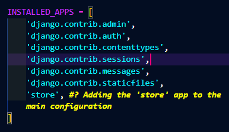

# Ecommerce Folder

The ecommerce folder contains a variety of files which serve different purposes:

* The **manage.py** file will manage and load all the configurations  (located inside the settings.py file) of the website
* The **__ init __.py** file only establishes the ecommerce folder as a module/project folder so the mage.py file can pull data from there
* The **wsgi.py** and asgi.pi files  will only be used in the final deployment fase
* The **urls.puy** file configures the url of the website and what content it will load based on the url
* Lastly the **settings.py** file is where we will configure the settings of the website such as criptografy, debuging mode, installed apps etc

  
