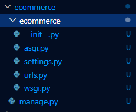

# Initializing

1. Create a virtual enviroment in vscode
2. Install django on the cmd prompt

```
pip install django
```

3. Whithout exiting the comand prompt, create the necessary project folders with:

```
django-admin startproject ecommerce
```



A django site is composed of many "apps" (sub-sites) that contain major features of the main site. Ex: a blog would be a separate "app" from a online store as they have significantly different features

    4. In order to perform actions and tests we always need to be located inside the main ecommerce directory.

```
cd ecommerce
```

    5. To create our first "app" (the store website), we need to run the following command that will create the folders and files necessary for its creation:

```
python manage.py startapp store
```


6. Lastly, in order to run the app localy use the following command:

```
python manage.py startapp store
```

And click the local host link that will be shown.
