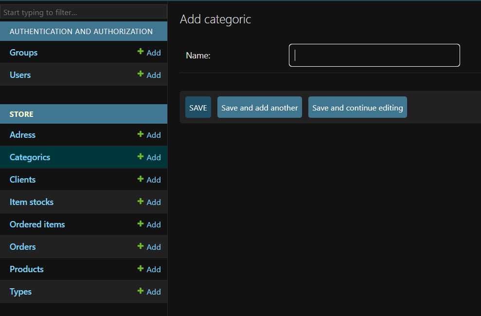
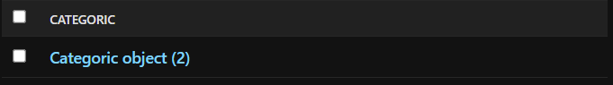

# Admin area and superuser

In order to manage the admin page of the website we first need to create a superuser account in the cmd prompt:

```
python manage.py createsuperuser
```


Note: the password is automatically hidden

After running the server, enter the admin page throught the '/admin' url and perform the login using the username and password just provided.

After logging in we enter in the admin page where we can manage all the users:


However, the data tables we created previously are not appearing on the page. In order to fix that we need to import the models  into the admin.py file located inside the store folder and register them:

```python
from .models import *

# Register your models here.
admin.site.register([Categoric, Client, Type, Product, ItemStock, Order, OrderedItem, Adres])
```

Now the data tables are showing correctly on the admin page:



When testing the page we run into another problem, after we add a new category / type the new item only shows as "object" instead of showing its actual name:




In order to fix this, we will add a new method to the 'Categoric' and 'Type' classes:

```python
class Categoric(models.Model):
    name = models.CharField(max_length=200, null=True, blank=True)

    def __str__(self) :
        return str(self.name)
```

The __ str__ method is responsible for what name is displayed after a item is created. In this case we want to display the name itself of the item.


Note: We don't need to execute the migration commands as we didn't change the database table itself, we only added a new method.
