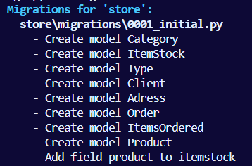

# Database models

| Client |
| :----: |
|  name  |
| email |
| phone |
|  user  |

---


| Categories (Ex: Masculine, feminine, infant, etc.) |
| :------------------------------------------------: |
|                        name                        |

---


| Types (Ex: shirts, shorts, pants, etc) |
| :------------------------------------: |
|                  name                  |

---


|                                                  Product                                                  |
| :-------------------------------------------------------------------------------------------------------: |
|                                                   image                                                   |
|                                                   name                                                   |
|                                                   price                                                   |
| active_state (cant delete the whole database if inactive as it would also delete all the history entries) |
|                                                 category                                                 |
|                                                   type                                                   |

---


| Itemstock (different variations of the item) |
| :------------------------------------------: |
|             product (Ex: shorts)             |
|                    color                    |
|           size (Ex: XL, L, M, etc)           |
|                   quantity                   |

---


|  Adress  |
| :-------: |
|  street  |
|  number  |
| apartment |
| zip_code |
|   city   |
|   state   |
|  client  |

---


|     Order     |
| :------------: |
|     client     |
|    end_date    |
|    finished    |
| id_transaction |
|     adress     |

---


With the prelimenary model ready we now can create the models themselves using classes, starting with the client model:

```python
class Client(models.Model): #? dont use plural names as django automatically puts a 's' after the name. Also a id is automatically created for each class
    name = models.CharField(max_length=200, null=True, blank=True) #? charfields are text fields. max_length determines the max number of characters
    email = models.CharField(max_length=200, null=True, blank=True)
    phone = models.CharField(max_length=200, null=True, blank=True)
    id_session = models.CharField(max_length=200, null=True, blank=True)
    user = models.OneToOneField(User, null = True, blank = True, on_delete = models.CASCADE) #? each client can only be one user and one user can only be one client. Cascade deletes everyting associated to the user if its account is deleted
```

Note: We added the null=True and blank=True parameters as the client will be able to perform purchases whithout having to create a account. The id_session attribute will be used to store the data provided by said users.

You also need to import the default table for Users in django used in authentication processes:

```python
from django.contrib.auth.models import User
```

Now we will repeat the procedure for the other elements, with slight variations that are shown in the code:

```python
class Categoric(models.Model):
    name = models.CharField(max_length=200, null=True, blank=True)


class Type(models.Model):
    name = models.CharField(max_length=200, null=True, blank=True)

class Product(models.Model):
    image = models.CharField(max_length = 400, null=True, blank=True) #? we will store the file name of the image so it can be accessed in the images folder
    name = models.CharField(max_length=200, null=True, blank=True)
    price = models.DecimalField(max_digits = 7, decimal_places = 2, null=True, blank=True) #? max price is 99,999.99
    active = models.BooleanField(default=True)
    category = models.ForeignKey(Categoric, blank=True, null=True, on_delete=models.SET_NULL) #? primary key is a id associated to only that category,ForeignKey relates a category to another category with a diferent id. One product has only one category but one category has many products
    product_type = models.ForeignKey(Type, blank=True, null=True, on_delete=models.SET_NULL) #? When you delete a type or category, it will only set that product type to null, and not all the others when using CASCADE

class ItemStock(models.Model):
    product = models.ForeignKey(Product, blank=True, null=True, on_delete=models.SET_NULL) #? one itemstock is associated to a single product however one product can have many itemstocks
    color = models.CharField(max_length=200, null=True, blank=True)
    size = models.CharField(max_length=200, null=True, blank=True)
    quantity = models.IntegerField(default=0)


class Adres(models.Model):
    street = models.CharField(max_length=200, null=True, blank=True)
    number = models.IntegerField(default=0)
    apartment = models.CharField(max_length=200, null=True, blank=True)
    zip_code = models.CharField(max_length=200, null=True, blank=True)
    city = models.CharField(max_length=200, null=True, blank=True)
    state = models.CharField(max_length=200, null=True, blank=True)
    client = models.ForeignKey(Client, blank=True, null=True, on_delete=models.SET_NULL)


class Order(models.Model):
    client = models.ForeignKey(Client, blank=True, null=True, on_delete=models.SET_NULL)
    end_date = models.DateTimeField(null=True, blank=True)
    finished = models.BooleanField(default=False)
    id_transaction = models.CharField(max_length=200, null=True, blank=True)
    adress = models.ForeignKey(Adres, blank=True, null=True, on_delete=models.SET_NULL)


class OrderedItems(models.Model):
    itemstock = models.ForeignKey(ItemStock, blank=True, null=True, on_delete=models.SET_NULL)
    quantity = models.IntegerField(default=0)
    order = models.ForeignKey(Order, blank=True, null=True, on_delete=models.SET_NULL)

```

**Note: Some classes such as 'adres' are itentionally written wrong as django automatically places a s after the names of the classes.**

Migrating the changes to the main database throught the cmd prompt:

```
python manage.py makemigrations
```



```
python manage.py migrate
```


